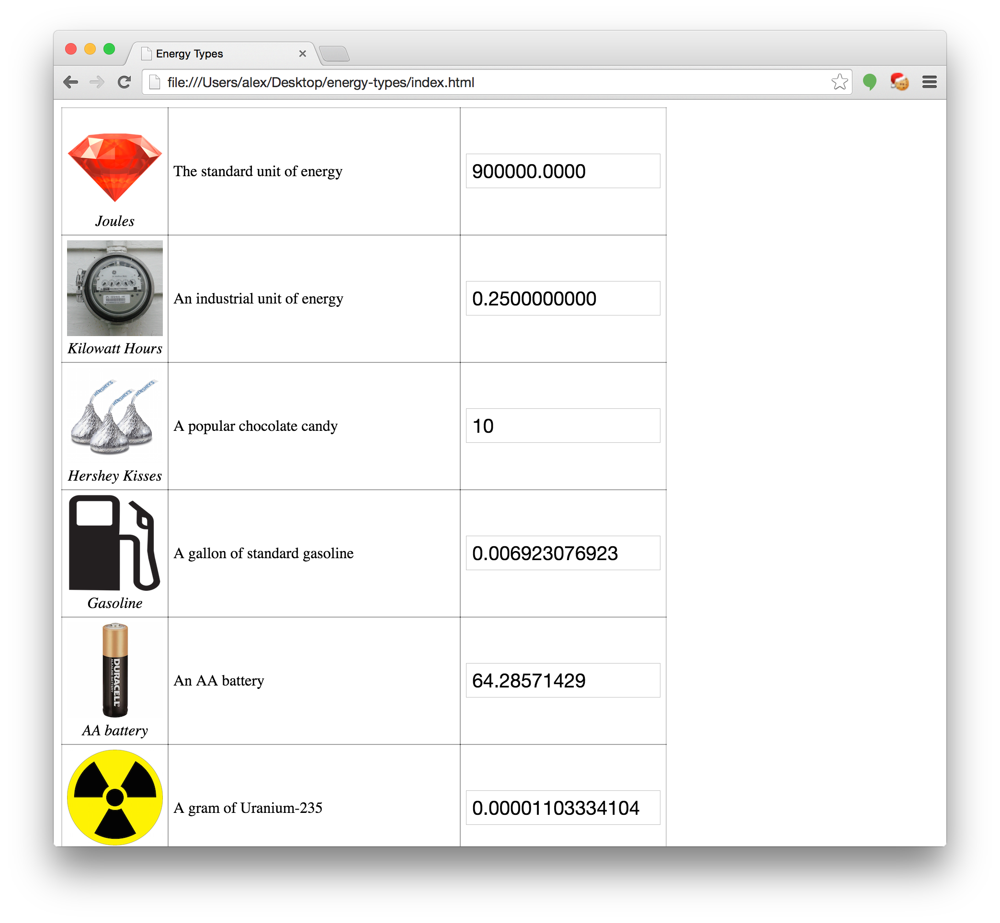

# energy-types

This is a simple, easy-to-use unit converter for energy. It provides a side-by-side comparison of many different units of energy.

# Screenshot

Simply open the index.html file to check this out. Here's an example of what it might look like:

